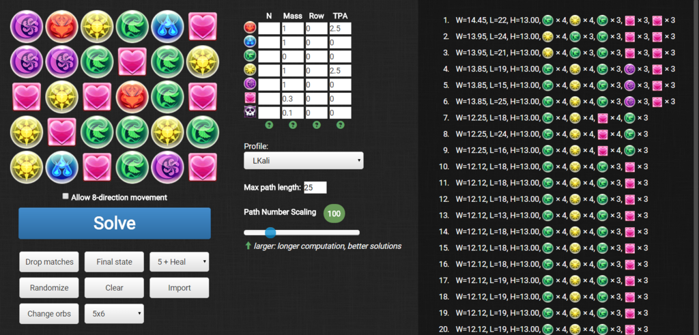
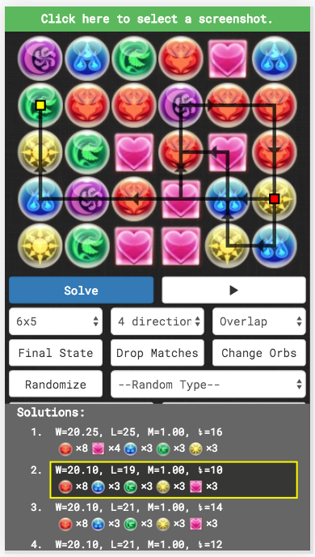

padopt - a Puzzle & Dragons Optimizer
=====================================

`padopt` is a Javascript-based web application that finds optimal paths in the mobile game Puzzle & Dragons.

Originally forked from kennytm's [pndopt](https://github.com/kennytm/pndopt) and based on [combo.tips](http://combo.tips). 90% of the credit goes to the aforementioned, including the main Javascript logic. While the program is mostly fine, the user experience left something to desired. In particular, left and right clicking led to context menus popping up and unintentional text selections. This fork's main purpose is to provide a nicer interface for the program.

Changelist
----------

* Increased margins in some elements (~2px).
* Changed orbs to the actual pad icons.
* Changed junk orb to poison orb (functionality is the same).
* Changed some tooltips to slightly more readable english.
* Changed some title text for coherency.
* Added LKali, DKali profiles.
* Changed Bastet profile to the now more common A. Bastet.
* Updated various profiles with guaranteed TPA / row values.
* Changed some heuristic values for better boards.
* Default path length updated to 25.
* Changed scrollbars to [perfect-scrollbar](https://github.com/noraesae/perfect-scrollbar).
* Added 7x6 board (by [adambot](https://github.com/adambot))

Usage
-----

1. (Optional) Select a profile to get better boards.
2. Left or right click on an orb to select its type.
3. Click "Solve" after completing the board.
4. Choose one solution and see how it is performed.

I recommend using this tool to check solutions and for learning purposes; it rarely if ever gives a truly optimal board solution and does not take into account unprotected cascades, orb movement timer, complexity of the path, and other details. That being said, do what you like with it.  ¯\\_(ツ)_/¯

Profiles and Calculations
-------------------------

All these do is change the weights of specific orb combinations to change the heuristic value of given solutions. Despite Rows being one of the possible inputs it does a pretty awful job of doing it. I wouldn't recommend using this tool for Row teams (and honestly you shouldn't need to given that they're almost never combo reliant).

For each main attribute add 1 to that color under 'N.' You can optionally add .3 to the columns for sub attributes but it won't change your results much. For color combo leads such as Kali, just put 1 for required colors and 0 for everything else.

For TPA calculations, each TPA on the monster is an additional 1.5 multiplier:

`tpa = 1*(1.5)^n - 1`

Add the resulting weights for each color.

For example, if you have 3 green monsters and one has a TPA and the other has two TPA, the base weight is 3 and the TPA effect is 1 x 1.5 for the single TPA (.5 extra) and 1 x 1.5 x 1.5 = 2.25 (1.25 extra) for the double TPA so you enter 1.75.

Alternatively just put 1 where you have TPAs and 0 where you don't.

Requirements
------------

* An updated browser - preferably chromium or Firefox.
* Javascript enabled.

TODO
----

* Fix the body scrollbar issue.
* Add orb painting.
* Fix some icon sizing issues.
* Introduce better solver (e.g. [this post](http://puzzleanddragonsforum.com/showthread.php?tid=1603&pid=6263#pid6263)). Currently just a brute-force greedy algorithm, which may not produce truly optimal results.
* Resolve overlapping lines and points.
* Simulate swapping and matching when playing the animation and dropping the matches.
* The default weight of the profiles may need to be adjusted.
* Randomizer is actually pretty awful and extremely slow the less orbs there are (due to trying to find a board setup without any matches). For some reason this crashes the page if I remove the find_matches function as well. Fix sometime soon hopefully since Sonia boards are really useful to learn.
