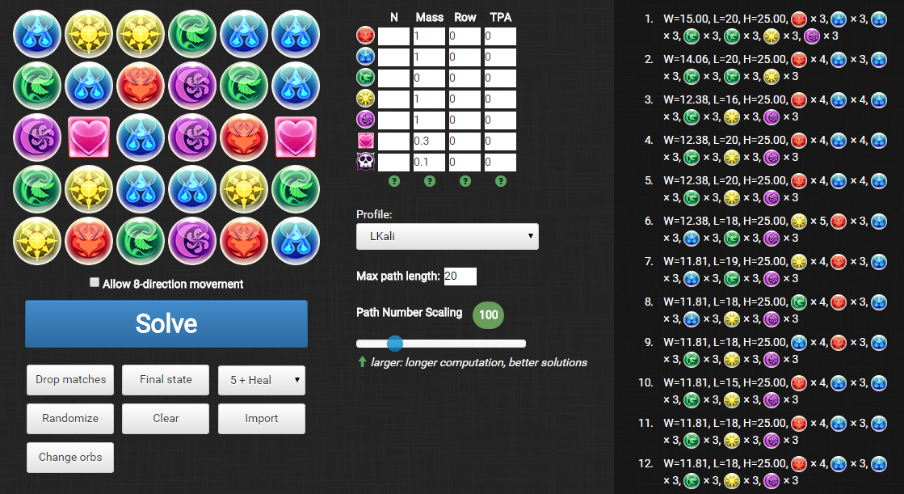

padopt - a Puzzle & Dragons Optimizer
=====================================

`padopt` is a Javascript-based web application that finds optimal paths in the mobile game Puzzle & Dragons.

Originally forked from kennytm's [pndopt](https://github.com/kennytm/pndopt) and based on [combo.tips](http://combo.tips). 90% of the credit goes to the aforementioned, including the main Javascript logic. While the program is mostly fine, the user experience left something to desired. In particular, left and right clicking led to context menus popping up and unintentional text selections. This fork's main purpose is to provide a nicer interface for the program.

Changelist
----------

* Increased margins in some elements (~2px).
* Changed orbs to the actual pad icons.
* Changed junk orb to poison orb (functionality is the same).
* Changed some tooltips to slightly more readable english.
* Changed some title text for coherency.
* Added LKali, DKali profiles.
* Changed Bastet profile to the now more common A. Bastet.
* Updated various profiles with guaranteed TPA / row values.
* Changed some heuristic values for better boards.
* Default path length updated to 25.

Usage
-----

1. Left or right click on an orb to select its type.
2. Click "Solve" after completing the board.
3. Choose one solution and see how it is performed.

I recommend using this tool to check solutions and for learning purposes; it rarely if ever gives a truly optimal board solution and does not take into account unprotected cascades, orb movement timer, complexity of the path, and other details. That being said, do what you like with it.  ¯\\_(ツ)_/¯

Requirements
------------

* An updated browser - preferably chromium or Firefox.
* Javascript enabled.

TODO
----

* Fix the body scrollbar issue.
* Add orb painting.
* Change scrollbars to [perfect-scrollbar](https://github.com/noraesae/perfect-scrollbar).
* Fix some icon sizing issues.
* Introduce better solver (e.g. [this post](http://puzzleanddragonsforum.com/showthread.php?tid=1603&pid=6263#pid6263)). Currently just a brute-force greedy algorithm, which may not produce truly optimal results.
* Resolve overlapping lines and points.
* Simulate swapping and matching when playing the animation and dropping the matches.
* The default weight of the profiles may need to be adjusted.